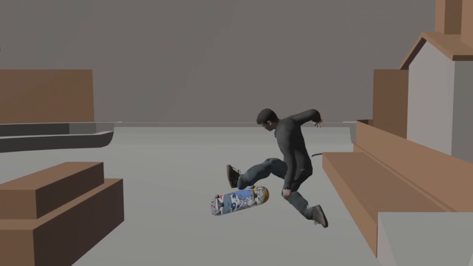
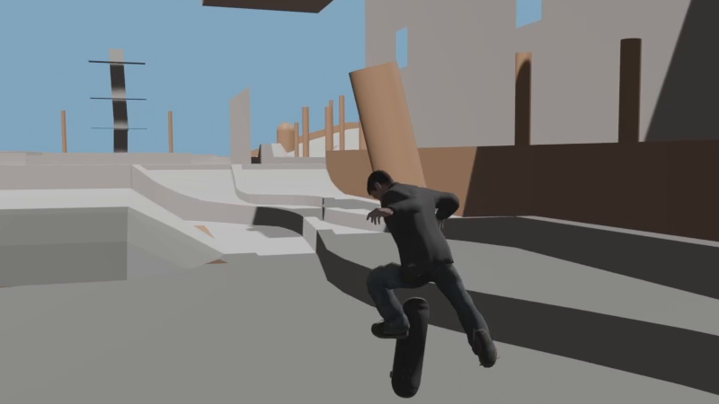
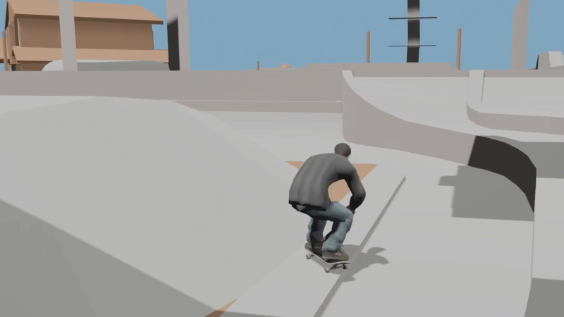

# Project 8 Rust Engine

An unofficial, from-scratch **Rust + Bevy** engine for **Tony Hawk's Project 8**
gameplay, in the spirit of the Skate 3 Rust Engine. It is not affiliated with
Activision or Neversoft.

**No game content is included, and none ever will be.** The engine reads the
scripts, levels, models and animations from *your own* installed copy of the
game at runtime.

The skater is a line-by-line translation of the original game code (from the
player's own disc, decompiled), not an imitation: each translated function
names the original address it comes from.

| | |
| --- | --- |
|  |  |

## What works

- **Original scripts:** the game's own QB scripts run in a translated script
  VM, so tricks, trick names, triggers and timings come from your copy.
- **Skating physics:** pushing, steering, braking, ollies (with the original
  jump speeds and tense time), nollie, boneless, no comply, air spin and
  lean, landings, walls, vert and quarter pipes, spine transfers, acid drops
  and bank drops.
- **Tricks:** the trick queue and button triggers, flip and grab tricks,
  manuals and manual tricks, lip tricks with the balance meter, stance
  switches and reverts.
- **Skater and animation:** the original skater model, board and animation
  tree (5,000+ clips), including foot IK and stance mirroring.
- **Levels:** the level's original collision and rails (shown as plain
  shapes; the textured level is not drawn yet).

Not there yet: grinds, wallrides, ragdoll bails, the score display, special
meter, walking, sound, menus and the textured level. Commands the scripts use
that are not translated yet are listed on screen while playing.

## Play

The same game builds and runs on Windows and macOS. There is one download
per platform, updated automatically after every change (only when the game
compiles on both):

- Windows: [Project8-Windows.zip](https://github.com/flevz/project-8-rust-engine/releases/download/latest/Project8-Windows.zip)
- macOS: [Project8-macOS.zip](https://github.com/flevz/project-8-rust-engine/releases/download/latest/Project8-macOS.zip)

Each holds the same game with that platform's launchers: `NAME.bat` on
Windows, `NAME.command` on a Mac, with the same steps and messages.

| Launcher | What it does |
| --- | --- |
| `INSTALL` | Checks for the build tools and Rust and explains how to get what is missing. |
| `BUILD` | Builds the game. The first build takes **10–20 minutes**; later builds take a minute or two. |
| `SETUP` | Asks for your game folder (drag it into the window) and remembers it. Run once. |
| `PLAY` | Starts the game. |
| `TEST` | Rebuilds, prints the test checklist (`TEST_CHECKLIST.txt`), then starts the game. |
| `INSPECT` | Writes `p8-inspect-report.txt` about your game files (see below). |

You need your own game data: the `DATA` folder of your installed Project 8.

### Windows

1. Download `Project8-Windows.zip` and unzip it (right-click > Extract All).
   Open the `Project8-Windows` folder.
2. Double-click `INSTALL.bat`. If it says something is missing, follow its
   steps (Rust from https://rustup.rs and the Visual Studio C++ build
   tools), restart the PC, and run it again until everything says `[OK]`.
3. Double-click `BUILD.bat`. The first build takes 10–20 minutes.
4. Double-click `SETUP.bat` and drag in your installed Project 8 folder. It
   remembers where your game files are (`scripts-location.txt`, kept on your
   machine only).
5. Double-click `PLAY.bat`.

### macOS

1. Download `Project8-macOS.zip` and double-click it to unzip. Move the
   `Project8-macOS` folder somewhere handy, such as your home folder.
2. Once per download, let macOS run the launchers: open **Terminal**
   (Applications > Utilities), type `xattr -dr com.apple.quarantine `
   (with a space at the end), drag the `Project8-macOS` folder into the
   Terminal window and press Enter. Nothing is printed; that is normal.
3. Double-click `INSTALL.command`. If it says something is missing, type `y`
   to install it (Apple's Command Line Tools, then Rust), and run it again
   until everything says `[OK]`.
4. Double-click `BUILD.command`. The first build takes 10–20 minutes.
5. Put your game data on the Mac: copy the `DATA` folder of your Project 8
   install from the PC (USB stick, cloud drive or network share) into a new
   folder such as `Project8Data` in your home folder, so you have
   `~/Project8Data/DATA`. (If you keep your own backup of that folder,
   unpack it there instead.)
6. Double-click `SETUP.command` and drag that `Project8Data` folder into the
   window, then press Enter.
7. Double-click `PLAY.command`.

To update (both platforms): download and unzip the new zip, then run
`BUILD` and `SETUP` in the new folder (on a Mac, do step 2 first). To skip
the long first build, move the `target` folder from your old copy into the
new one before running `BUILD`.

### Troubleshooting (macOS)

- **"cannot be opened because it is from an unidentified developer"** (or
  "Apple could not verify…"): this happens to `.command` files that came
  from a downloaded zip and step 2 was skipped. Do step 2 (it clears the
  whole folder at once). For a single file you can also right-click it >
  **Open** > **Open**, or on newer macOS open System Settings > Privacy &
  Security and click **Open Anyway**.
- **"…could not be executed because you do not have appropriate access
  privileges"**: the files lost their "can run" mark (for example after
  copying through a USB stick). In Terminal, type `chmod +x ` and drag
  the `.command` files into the window, then press Enter.
- **"Terminal would like to access files in your Documents / Desktop /
  Downloads folder"**: click **Allow**. The launchers only read the engine
  folder and the game folder you chose.
- **Controller**: pair it first in System Settings > Bluetooth (Xbox
  Wireless: hold the pairing button on top until the logo flashes fast;
  PlayStation: hold Share/Create and PS until the light flashes), then start
  the game. PlayStation controllers also work with a USB cable; Xbox
  controllers need Bluetooth on a Mac. The keyboard always works. The controller
  does not vibrate on a Mac: Bevy's gamepad library has no rumble support
  on macOS yet.
- **Build fails with `xcrun: error: invalid active developer path`**: the
  Command Line Tools are missing. Run `INSTALL.command`.

Controls (the original Project 8 layout):

| Action | Controller | Keyboard |
| --- | --- | --- |
| Push, steer, lean, spin in the air | Left stick | W A S D |
| Crouch (hold) / ollie (release) | A | Space |
| Flip / grab / grind and lip tricks | X / B / Y | Y only: F |
| Spin | LB / RB | Q / E |
| Nollie (hold A) / switch stance | LT / RT | Left Shift (LT) |
| Manual | Stick up then down | W then S |
| Restart | Back | R |

## Help map the game files

1. Install Project 8 with Project8Recomp (https://github.com/theokyr/Project8Recomp) (Thank you to theokyr) from your own disc. Its launcher
   copies the game data into its folder.
2. Double-click `INSPECT.bat` (Mac: `INSPECT.command`) and drag that folder
   into the window.
3. Share `p8-inspect-report.txt`. It contains names, counts and sizes only.

## Layout

| Crate | Role |
| --- | --- |
| `crates/p8-skater` | The translated skater: physics, tricks, animation tree, controller path. |
| `crates/p8-script` | The translated script VM that runs the game's own scripts. |
| `crates/p8-formats` | Readers for the game's files, plus `p8-inspect`. |
| `crates/p8-game` | The Bevy application. |
| `crates/p8-sim` | The first hand-tuned prototype, used only when no game files are set up. |
