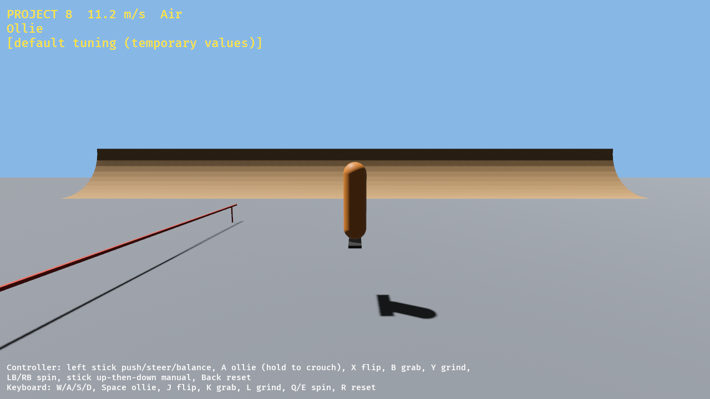

# Project 8 Rust Engine

An unofficial, from-scratch **Rust + Bevy** engine for **Tony Hawk's Project 8**
gameplay, in the spirit of the Skate 3 Rust Engine. It is not affiliated with
Activision or Neversoft.

**No game content is included, and none ever will be.** Later stages read
levels, models and animations from *your own* installed copy of the game.

## Status: stage 1 prototype

- A Project 8-style skater: pushing, turning, slopes, walls, ollie, spins,
  flips, grabs, landing checks, manuals, grinds and bails. `SETUP.bat` loads
  **original Project 8 physics values** (gravity, jump speeds, top speed,
  turning, spin, braking) from your own copy. The movement code itself is
  still an approximation until the original code is translated.
- An original test park (quarter pipes, kickers, a funbox and a rail) with
  placeholder visuals.
- `p8-inspect`, which scans your installed game files and reports their
  structure, so that the file formats can be worked out safely.

See [docs/ROADMAP.md](docs/ROADMAP.md) for the stages.

## Play (Windows)

Requires Rust (https://rustup.rs) and the Visual Studio C++ build tools.

1. Double-click `BUILD.bat`. The first build takes a while.
2. Double-click `SETUP.bat` and drag in your installed Project 8 folder. It
   reads the original skater physics values from your own `qb.pak.xen` into
   a local `tuning.json` (see `p8-setup-report.txt`).
3. Double-click `PLAY.bat`.

Controls:

| Action | Controller | Keyboard |
| --- | --- | --- |
| Push, steer, balance | Left stick | W A S D |
| Ollie (hold to crouch) | A | Space |
| Flip / grab / grind | X / B / Y | J / K / L |
| Spin | LB / RB | Q / E |
| Manual | Stick up then down | W then S |
| Reset | Back | R |

Put a `tuning.json` beside the launchers to override handling values. Its
field names are listed in `crates/p8-sim/src/tuning.rs`.

## Help map the game files

1. Install Project 8 with Project8Recomp from your own disc. Its launcher
   copies the game data into its folder.
2. Double-click `INSPECT.bat` and drag that folder into the window.
3. Share `p8-inspect-report.txt`. It contains names, counts and sizes only.

## Layout

| Crate | Role |
| --- | --- |
| `crates/p8-sim` | Skater simulation. Engine-independent and unit-tested. |
| `crates/p8-formats` | Readers for the game's files, plus `p8-inspect`. |
| `crates/p8-game` | The Bevy application. |
